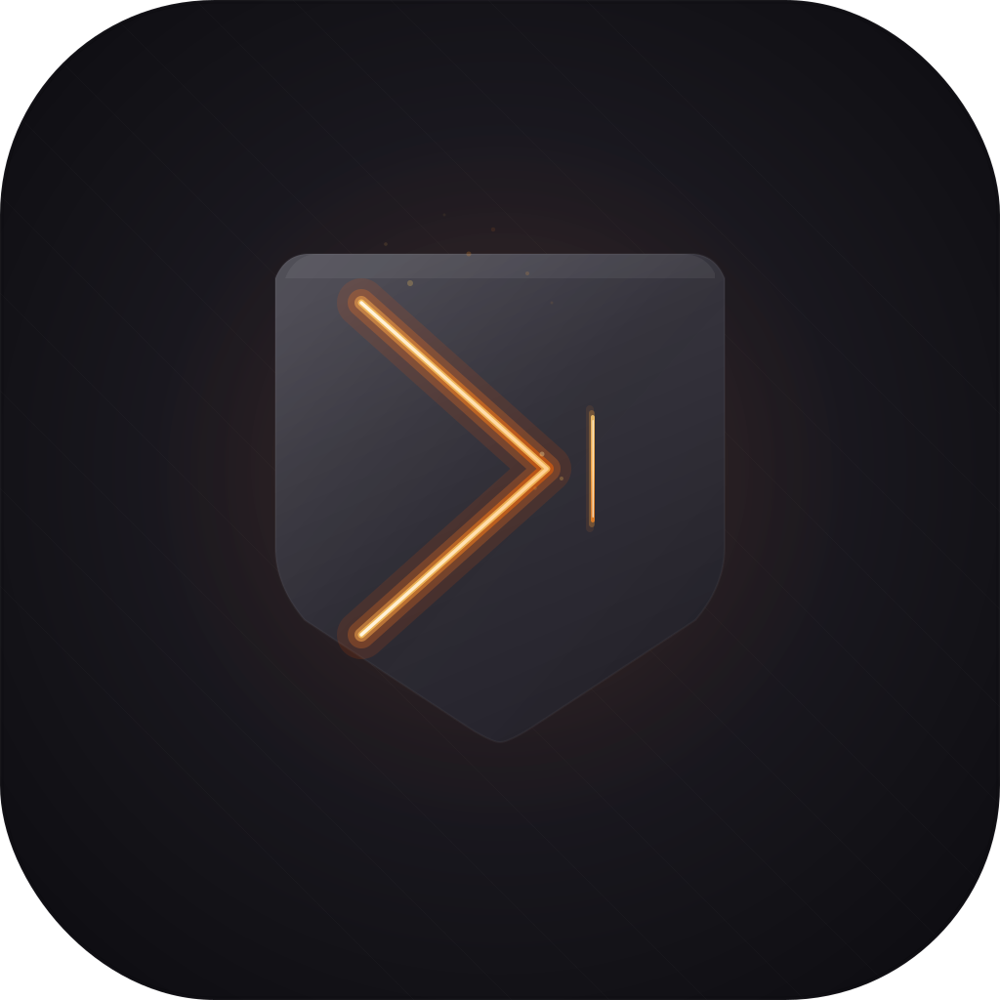
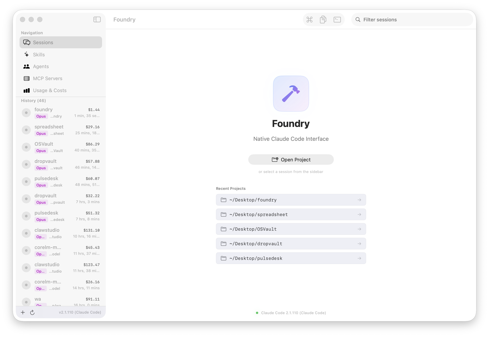
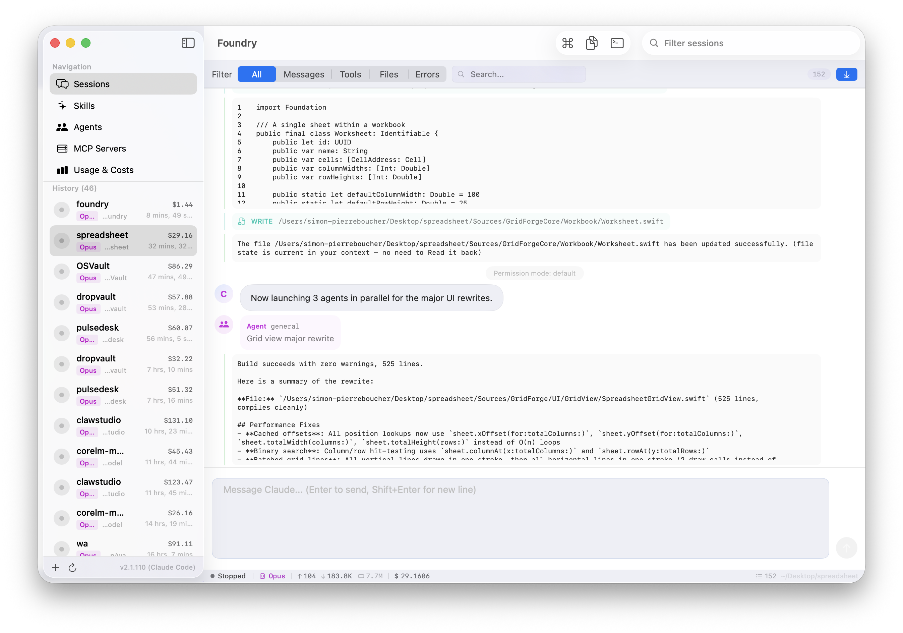
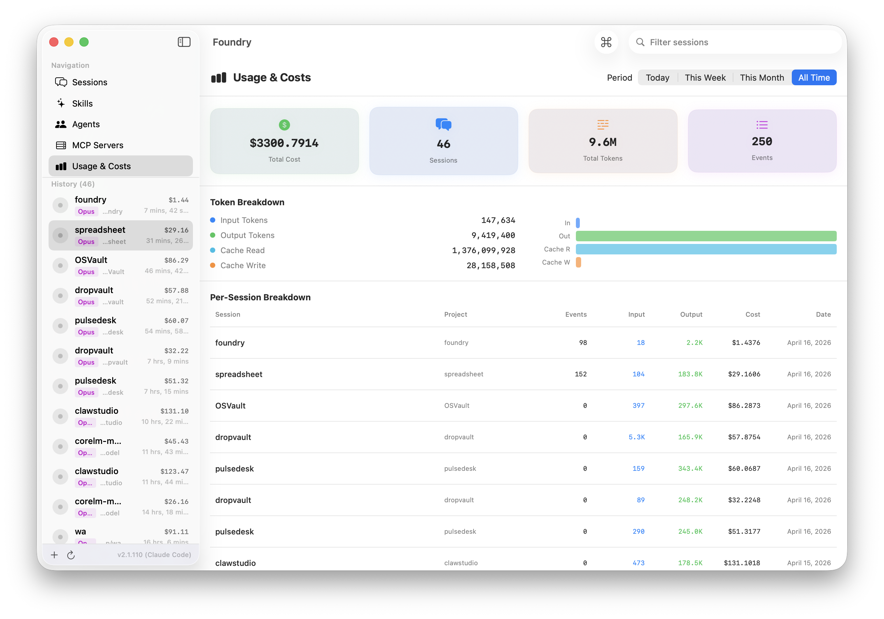
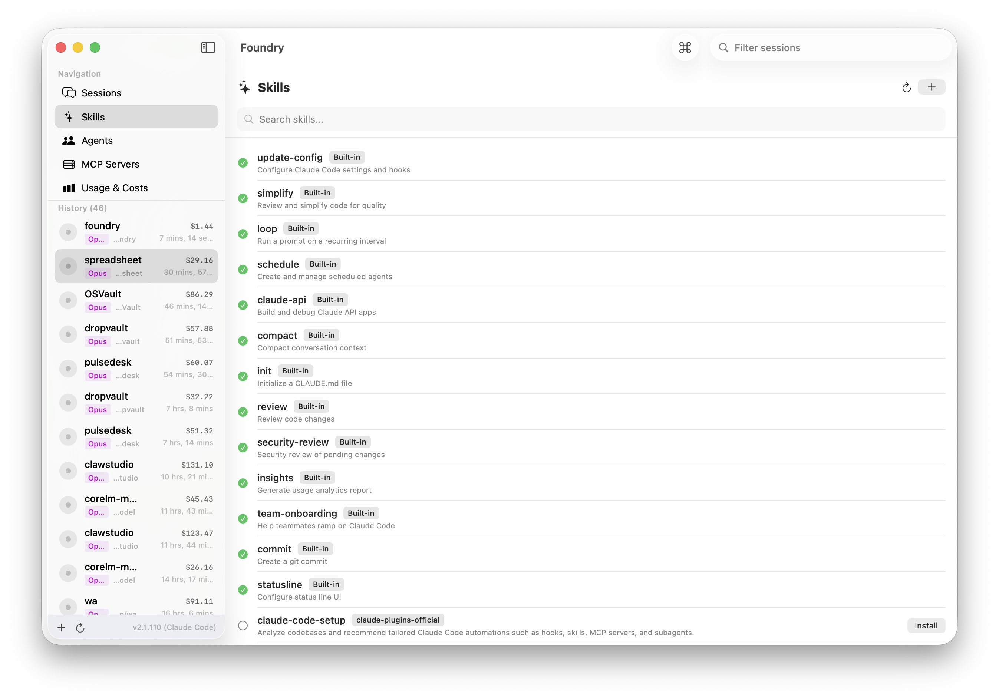
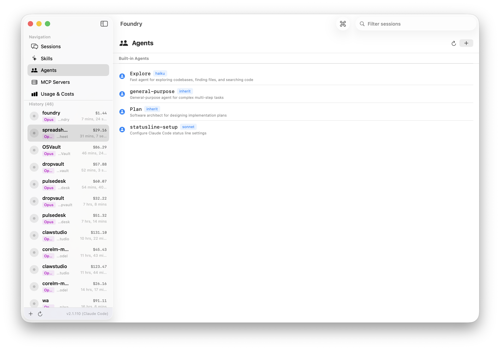
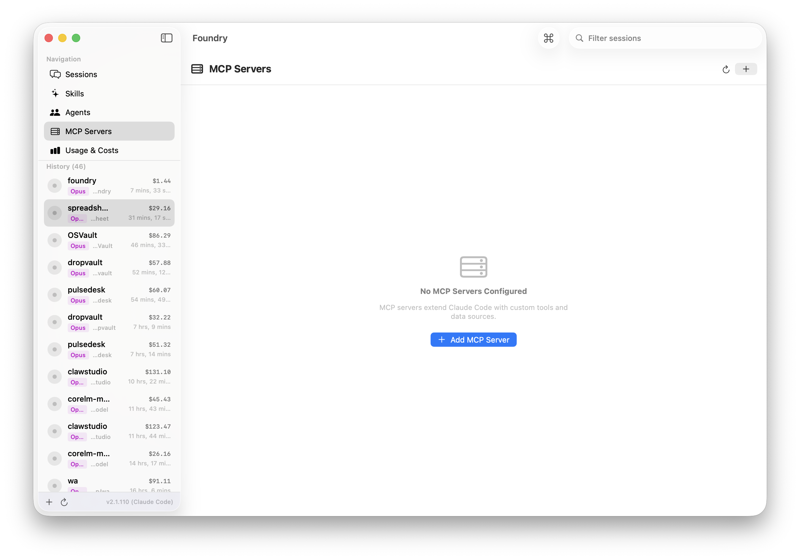

<p align="center">
  
</p>

<p align="center">
  
</p>

<h1 align="center">Foundry</h1>

<p align="center">
  <strong>The Native Claude Code Interface for macOS</strong>
</p>

<p align="center">
  <a href="#installation"></a>
  <a href="#"></a>
  <a href="#"></a>
  <a href="#"></a>
  <a href="#"></a>
  <a href="#"></a>
</p>

<p align="center">
  <a href="#"></a>
  <a href="#"></a>
  <a href="#"></a>
  <a href="#"></a>
  <a href="#"></a>
  <a href="#"></a>
</p>

---

<p align="center">
  <em>Built by <a href="https://worthdoing.ai">WorthDoing AI</a></em>
</p>

---

## Screenshots

<p align="center">
  
  <br><em>Welcome screen with session history, recent projects, and navigation sidebar</em>
</p>

<p align="center">
  
  <br><em>Session timeline with code blocks, tool events, agent spawns, and status bar</em>
</p>

<p align="center">
  
  <br><em>Usage dashboard with cost analytics, token breakdown, and per-session table</em>
</p>

<details>
<summary><strong>More screenshots</strong></summary>

<p align="center">
  
  <br><em>Skills browser — built-in and marketplace plugins with one-click install</em>
</p>

<p align="center">
  
  <br><em>Agents management — view built-in agents and add custom ones</em>
</p>

<p align="center">
  
  <br><em>MCP server management — add, configure, and remove MCP servers</em>
</p>

</details>

---

## Download

<p align="center">
  <a href="https://github.com/Worth-Doing/foundry/releases/download/v4.0.0/Foundry-4.0.0.dmg">
    
  </a>
</p>

> **[Foundry-4.0.0.dmg](https://github.com/Worth-Doing/foundry/releases/download/v4.0.0/Foundry-4.0.0.dmg)** — 2.9 MB | Apple Notarized | Code Signed | macOS 14+

---

## What's New in 4.0.0

### Premium Session Management

Foundry 4.0 transforms session management into a first-class experience:

- **Pin sessions** to the top of the sidebar for quick access
- **Favorite sessions** with star indicators
- **Session notes** — add freeform notes to any session
- **Tags** — organize sessions with custom tags
- **Group by project** — toggle to cluster history sessions by project directory
- **Improved context menu** — pin, favorite, notes, rename, duplicate, reveal in Finder

### Full-Text Search

Search across your entire Claude Code history:

- **Global search** via Command Palette (`Cmd+K` → Search mode)
- Searches session names, project paths, message content, file changes, notes, and tags
- Results show preview snippets with match context
- Click any result to jump directly to that session

### Collapsible Tool Groups

Consecutive tool events (Bash, Read, Edit, Write, Grep, etc.) are now automatically grouped:

- **Collapse/expand** individual tool sequences or all at once
- Collapsed view shows action count, tool names, and file count
- Expanded view shows full detail for each action
- Toolbar button to collapse/expand all groups globally

### Upgraded Command Palette

The Command Palette (`Cmd+K`) is now a true power-user hub:

- **4 modes** — Commands, Sessions, Projects, Search
- **Switch sessions** instantly from the palette
- **Open recent projects** or browse for new ones
- **Search everything** across all sessions
- Mode tabs and breadcrumb navigation

### Enhanced File Changes Panel

- **Deduplication** — shows unique files only (latest change per path)
- **Summary bar** — created/modified/deleted counts with colored icons
- **Open in editor** — click to open in your default editor
- **Reveal in Finder** — hover action on each file
- **Change type badge** — colored letter (C/M/D/R) for each file

### Session Resume Fix

Critical fix for session reuse reliability:

- **Proper controller lifecycle** — stopped sessions now get a fresh controller when you send a new message
- **Shell environment resolution** — captures your login shell's full PATH (fixes exit 127)
- **Concurrent send protection** — prevents duplicate processes for the same session
- **Structured error types** — 10 specific error categories with actionable recovery
- **Error recovery UI** — retry, recreate session, or dismiss with preserved draft messages
- **Preflight validation** — checks project path, Claude binary, session ID before launching

### More Keyboard Shortcuts

| Shortcut | Action |
|----------|--------|
| `Cmd+[` / `Cmd+]` | Previous / Next session |
| `Cmd+W` | Close (stop) session |
| `Cmd+Shift+P` | Pin / Unpin session |
| `Cmd+Shift+D` | Favorite / Unfavorite session |
| `Cmd+Shift+C` | Copy last Claude response |
| `Cmd+1` to `Cmd+5` | Navigate to Sessions / Skills / Agents / MCP / Usage |
| `Cmd+Option+R` | Reload Claude Code sessions |

### Design System Polish

- **Typography presets** — consistent font styles across the app
- **Shimmer loading effect** — skeleton loading states
- **Reusable empty states** — standardized empty state components
- **Status badges** — compact and full status indicators
- **Copy buttons** — hover to reveal copy-to-clipboard on messages, tool outputs, and search results
- **Reveal in Finder** — file events show reveal button on hover

### Settings Improvements

- **Keyboard shortcuts reference** — all shortcuts listed in General tab
- **Claude Code installation status** — green/red checkmark with executable path
- **Connection test button** — verify Claude Code availability
- **Environment diagnostics** — see resolved PATH directories with exists/missing indicators
- **Refresh environment cache** — re-resolve shell environment on demand

---

## What is Foundry?

**Foundry** is a native macOS application that transforms [Claude Code](https://docs.anthropic.com/en/docs/claude-code) from an opaque CLI tool into a **visible, structured, and controllable system**.

Foundry is **not** a terminal emulator.  
Foundry is **not** a chatbot wrapper.  
Foundry is a **native execution environment** for Claude Code sessions.

> Claude Code becomes invisible. Foundry becomes the product.

### The Problem

Claude Code is extraordinarily powerful, but when used via the CLI:

- Agent activity is hard to follow in raw terminal output
- Session history is buried in hidden dotfiles
- Multi-session management requires multiple terminal tabs
- Token usage and costs are invisible
- File changes are hard to track
- Slash commands require memorization

### The Solution

Foundry gives you:

| Feature | Description |
|---------|-------------|
| **Structured Timeline** | Every action visualized — messages, tool calls, file edits, agent spawns |
| **Chat Interface** | Modern chat bubbles with Enter-to-send, Markdown rendering, code blocks |
| **Usage Analytics** | Real-time token counts, cost breakdown per session and total |
| **MCP Management** | View, add, and remove MCP servers directly from the UI |
| **Agent Viewer** | See all configured agents, add custom ones to settings.json |
| **Skills Browser** | Browse all slash commands and marketplace plugins, install with one click |
| **File Tracking** | Monitor file changes with diff visualization |
| **Multi-Session** | Run parallel Claude Code sessions, switch instantly |
| **Full History** | Every Claude Code session ever run on your machine, loaded automatically |
| **Session Search** | Full-text search across sessions, messages, files, notes, and tags |
| **Session Organization** | Pin, favorite, tag, and add notes to sessions |
| **Command Palette** | Multi-mode palette for commands, sessions, projects, and search |
| **Light & Dark Themes** | Premium light theme by default, with system and dark options |
| **Persistent Settings** | All preferences survive restarts — theme, model, panels, permissions |

---

## Features

### Native macOS Experience

<table>
<tr>
<td width="50%">

**100% Native SwiftUI**
- No Electron, no web wrappers
- Hardware-accelerated rendering
- Native macOS controls and behaviors
- Light theme by default, Dark and System modes available
- Full keyboard navigation
- Retina display optimized

</td>
<td width="50%">

**Professional Developer Tool**
- NavigationSplitView with resizable panels
- Collapsible sidebar, file panel, terminal panel
- Global keyboard shortcuts
- Menu bar integration
- Settings window with persistent preferences
- Forge-themed app icon in Dock

</td>
</tr>
</table>

---

### Modern Chat Interface

The conversation view is designed for productivity, not novelty:

- **Enter to send** — `Shift+Enter` for new line (custom `NSTextView` wrapper)
- **Chat bubbles** — user messages right-aligned in blue, Claude left-aligned with avatar
- **Copy on hover** — clipboard button appears on any message when hovered
- **Full Markdown rendering** including:
  - `# Headings` at all levels
  - **Bold**, *italic*, `inline code`
  - Fenced code blocks with language label and **Copy button**
  - Bullet and numbered lists
  - Blockquotes with colored sidebar
  - Tables with striped rows
  - Horizontal rules
- **Collapsible tool groups** — consecutive tool actions grouped with expand/collapse
- **Animated typing indicator** (bouncing dots) when Claude is working
- **Processing bar** with real-time status and Stop button
- **Hover timestamps** on all messages
- **Error recovery banner** — retry, recreate session, or dismiss with preserved draft

---

### Complete Claude Code Session History

Foundry reads **every session** directly from Claude Code's data files:

```
~/.claude/projects/*/                  # All project directories
  └── <session-id>.jsonl               # Full conversation logs (JSONL format)
```

**What gets loaded:**
- All sessions from all projects on the machine
- User messages and prompts
- Assistant responses with full Markdown
- Thinking blocks (collapsible)
- Tool use — Bash, Read, Write, Edit, Grep, Glob, Agent, etc.
- Tool results with collapsible output
- File operations (read/write/edit) with paths
- Search operations with patterns
- Sub-agent spawns with type and description
- Error events with exit codes
- System events and permission mode changes
- Token usage per assistant message (input, output, cache read, cache write)

**Cost calculation** is computed automatically from token usage with model-specific pricing:

| Model | Input | Output | Cache Read | Cache Write |
|-------|-------|--------|------------|-------------|
| Opus 4.6 | $15.00/M | $75.00/M | $1.50/M | $18.75/M |
| Sonnet 4.6 | $3.00/M | $15.00/M | $0.30/M | $3.75/M |
| Haiku 4.5 | $0.80/M | $4.00/M | $0.08/M | $1.00/M |

---

### Live Claude Code Integration

Send messages directly from Foundry — Claude Code runs in the background:

```
claude -p "<message>" --output-format stream-json --verbose --resume <session-id>
```

**How it works:**
1. You type a message and press Enter
2. Foundry validates the session, project path, and Claude binary (preflight)
3. Foundry resolves your login shell environment for full PATH
4. A Claude Code process is spawned with `--output-format stream-json --verbose`
5. Stream-JSON events are parsed in real time
6. Events appear in the timeline with proper formatting
7. Session ID is captured for `--resume` on next message
8. Token usage and costs are updated automatically

**Session resume** — select any stopped session from the sidebar, type a message, and Foundry automatically creates a fresh controller with `--resume` to continue the conversation.

---

### Command Palette

Press `Cmd+K` for a multi-mode command palette:

| Mode | What it does |
|------|-------------|
| **Commands** | All Claude Code slash commands + quick actions |
| **Sessions** | Search and switch between sessions instantly |
| **Projects** | Open recent projects or browse for new ones |
| **Search** | Full-text search across all session content |

**Slash Commands:**

| Category | Commands |
|----------|----------|
| **Session** | `/clear` `/compact` `/resume` `/status` |
| **Code** | `/review` `/simplify` `/security-review` `/init` |
| **Git** | `/commit` `/pr-comments` |
| **Configuration** | `/config` `/permissions` `/model` `/memory` `/vim` `/terminal-setup` |
| **Account** | `/login` `/logout` |
| **Analysis** | `/cost` `/insights` |
| **System** | `/help` `/doctor` `/bug` `/schedule` `/loop` |

---

### Skills Management

Browse and install Claude Code skills and plugins:

- **Built-in skills** — `update-config`, `simplify`, `loop`, `schedule`, `claude-api`, `compact`, `init`, `review`, `security-review`, `insights`, `team-onboarding`, `commit`, `statusline`
- **Marketplace plugins** — Browse the `claude-plugins-official` marketplace
- **One-click install** — Install plugins directly from the UI
- **Status indicators** — See which skills are installed vs available

---

### Agents Management

View and configure Claude Code agents:

- **Built-in agents** — `general-purpose`, `Explore` (haiku), `Plan`, `statusline-setup` (sonnet)
- **Custom agents** — Add your own with name, description, model, and system prompt
- **Saves to settings.json** — Custom agents persist in Claude Code's config

---

### MCP Server Management

Full MCP (Model Context Protocol) server lifecycle management:

- **View configured servers** across all scopes (user, project, local)
- **Add new servers** with type, command, arguments, scope, and environment variables
- **Remove servers** directly from the UI
- **Check `.mcp.json`** files for additional server configs

---

### Usage & Costs Dashboard

Comprehensive analytics for your Claude Code usage:

- **Summary cards** — Total cost, session count, total tokens, total events
- **Token breakdown** — Input, output, cache read, cache write with visual bars
- **Per-session table** — Name, project, events, tokens in/out, cost, date
- **Time filters** — Today, This Week, This Month, All Time
- **Total row** — Aggregated totals for the selected period
- **Cost per session** shown in sidebar next to each session

---

### Additional Panels

| Panel | Description |
|-------|-------------|
| **File Changes** | Deduplicated file list with summary counts, open-in-editor, reveal in Finder |
| **Terminal Output** | Raw stdout/stderr/system logs with source filtering and search |
| **Diff View** | Side-by-side or unified diff visualization with line numbers |
| **Status Bar** | Color-coded model name, tokens in/out, cache stats, cost, file changes, project path |
| **Settings** | General, Models, Permissions, Memory, Advanced, About — all persistent |

---

## Architecture

```
Sources/Foundry/
├── FoundryApp.swift                    # @main SwiftUI App entry point
├── DesignSystem.swift                  # Glass modifiers, typography, spacing, animations
├── Utilities.swift                     # Shared helpers (formatting, display, panels)
│
├── Models/
│   ├── Session.swift                   # Session with pins, favorites, notes, tags
│   ├── SessionEvent.swift              # Event types, metadata, stream JSON models
│   └── ClaudeCommand.swift             # Slash command registry with categories
│
├── Services/
│   ├── AppSettings.swift               # Persistent settings (UserDefaults)
│   ├── ClaudeHistoryLoader.swift       # Discovers & parses all sessions from ~/.claude/
│   ├── ClaudeProcessController.swift   # Process lifecycle, preflight, error mapping
│   ├── SessionManager.swift            # Multi-session state, search, organization
│   ├── EventParser.swift               # Stream-json line parser
│   ├── FileMonitor.swift               # DispatchSource-based file system watcher
│   ├── PersistenceManager.swift        # JSON persistence in Application Support
│   └── DiffEngine.swift                # LCS-based line diff + unified diff parser
│
├── Views/
│   ├── MainView.swift                  # Root layout with NavigationSplitView
│   ├── MarkdownView.swift              # Full Markdown renderer
│   ├── PromptView.swift                # Chat input with error recovery banner
│   ├── CommandPaletteView.swift        # Multi-mode command palette
│   ├── OnboardingView.swift            # Claude not found + install instructions
│   ├── StatusBarView.swift             # Bottom status bar
│   ├── SettingsView.swift              # Tabbed settings with diagnostics
│   ├── TerminalView.swift              # Raw log output with filtering
│   ├── Sidebar/
│   │   └── SidebarView.swift           # Session list with pins, favorites, groups
│   ├── Timeline/
│   │   ├── TimelineView.swift          # Timeline with collapsible tool groups
│   │   └── TimelineEventView.swift     # Chat bubbles, tool cards, copy buttons
│   └── Panels/
│       ├── SkillsView.swift            # Skills browser
│       ├── AgentsView.swift            # Agent viewer
│       ├── MCPView.swift               # MCP server manager
│       ├── UsageView.swift             # Cost analytics dashboard
│       └── DiffView.swift              # Unified/side-by-side diff viewer
│
└── Tests/
    └── FoundryTests/
        └── SessionMessagingTests.swift # Error mapping, preflight, environment tests
```

---

## System Requirements

| Requirement | Minimum |
|-------------|---------|
| **macOS** | 14.0 (Sonoma) or later |
| **Architecture** | Apple Silicon (arm64) |
| **Claude Code** | Must be installed (`npm install -g @anthropic-ai/claude-code`) |
| **Disk Space** | ~10 MB |

---

## Installation

### Option 1: Download DMG (Recommended)

1. **[Download Foundry-4.0.0.dmg](https://github.com/Worth-Doing/foundry/releases/download/v4.0.0/Foundry-4.0.0.dmg)**
2. Open the DMG
3. Drag **Foundry** to **Applications**
4. Launch from Applications or Spotlight

> Apple Notarized — no Gatekeeper warnings  
> Code Signed with Developer ID  
> Hardened Runtime enabled

### Option 2: Build from Source

```bash
# Clone the repository
git clone https://github.com/Worth-Doing/foundry.git
cd foundry

# Build (release)
swift build -c release

# Run
.build/release/Foundry
```

**Build Requirements:**
- Swift 6.0+ toolchain
- macOS 14.0+ SDK
- Command Line Tools (`xcode-select --install`)

---

## Usage

### First Launch

1. Foundry checks if Claude Code is installed
2. If not found, an onboarding screen shows installation instructions
3. If found, all existing Claude Code sessions are loaded automatically

### Browsing & Resuming Sessions

- All sessions from `~/.claude/projects/` appear in the sidebar
- Click any session to load its conversation timeline
- **Type a message and press Enter** to resume the session — Foundry automatically creates a fresh process with `--resume`
- Pin or favorite important sessions for quick access

### Starting a New Session

1. Click **+** in the sidebar or `Cmd+N`
2. Select a project directory
3. Type a message and press **Enter**

### Keyboard Shortcuts

| Shortcut | Action |
|----------|--------|
| `Enter` | Send message |
| `Shift+Enter` | New line in message |
| `Cmd+K` | Command palette |
| `Cmd+N` | New session |
| `Cmd+O` | Open project |
| `Cmd+.` | Stop active session |
| `Cmd+W` | Close session |
| `Cmd+[` / `Cmd+]` | Previous / Next session |
| `Cmd+Shift+R` | Restart session |
| `Cmd+Shift+P` | Pin / Unpin session |
| `Cmd+Shift+D` | Favorite / Unfavorite session |
| `Cmd+Shift+C` | Copy last response |
| `Cmd+Shift+T` | Toggle terminal panel |
| `Cmd+Shift+F` | Toggle file panel |
| `Cmd+1` to `Cmd+5` | Navigate pages |
| `Cmd+Option+R` | Reload sessions |
| `Ctrl+Cmd+S` | Toggle sidebar |

---

## Configuration

### Settings

Access via **Foundry > Settings** or the gear icon:

| Tab | What it configures |
|-----|-------------------|
| **General** | Theme, auto-save, raw output, max log entries, panel visibility, keyboard shortcuts reference |
| **Models** | Default model selection (Opus / Sonnet / Haiku) with capability descriptions |
| **Permissions** | Permission mode (default, acceptEdits, plan, auto) |
| **Memory** | Access Claude Code memory files in `~/.claude/` |
| **Advanced** | Claude Code path validation, environment diagnostics, PATH inspector, health check, data management |
| **About** | Version info, credits |

---

## Project Stats

| Metric | Value |
|--------|-------|
| **Version** | 4.0.0 |
| **Language** | Swift 6.0 |
| **Framework** | SwiftUI (100% native) |
| **Lines of Code** | 11,000+ |
| **Swift Files** | 31 |
| **Build System** | Swift Package Manager |
| **Binary Size** | ~4.7 MB (release, arm64) |
| **DMG Size** | 2.9 MB |
| **Min macOS** | 14.0 (Sonoma) |
| **Signing** | Developer ID + Hardened Runtime |
| **Notarization** | Apple Notarized + Stapled |

---

## Roadmap

- [x] Light theme with persistent settings
- [x] New forge-themed app icon
- [x] Real-time streaming (line-by-line output)
- [x] Glass UI redesign (iOS 26 glassmorphism)
- [x] Autosave sessions to Application Support
- [x] Live file monitoring with DispatchSource
- [x] Session pinning, favorites, notes, and tags
- [x] Full-text search across all sessions
- [x] Collapsible tool groups in timeline
- [x] Multi-mode command palette (commands, sessions, projects, search)
- [x] Session resume fix (proper controller lifecycle)
- [x] Shell environment resolution (login shell PATH)
- [x] Structured error handling with recovery UI
- [x] Enhanced file changes panel with open/reveal actions
- [x] Keyboard shortcuts (20+ shortcuts)
- [x] Settings with environment diagnostics
- [ ] Export session as Markdown
- [ ] Git integration (branch awareness, commit history)
- [ ] Multiple windows support

---

## Credits

**Foundry** is built and maintained by **[WorthDoing AI](https://worthdoing.ai)**.

Built entirely using **[Claude Code](https://docs.anthropic.com/en/docs/claude-code)** by Anthropic — the very tool Foundry was designed to interface with.

---

<p align="center">
  
</p>

<p align="center">
  <sub>&copy; 2025 WorthDoing AI. All rights reserved.</sub>
</p>
